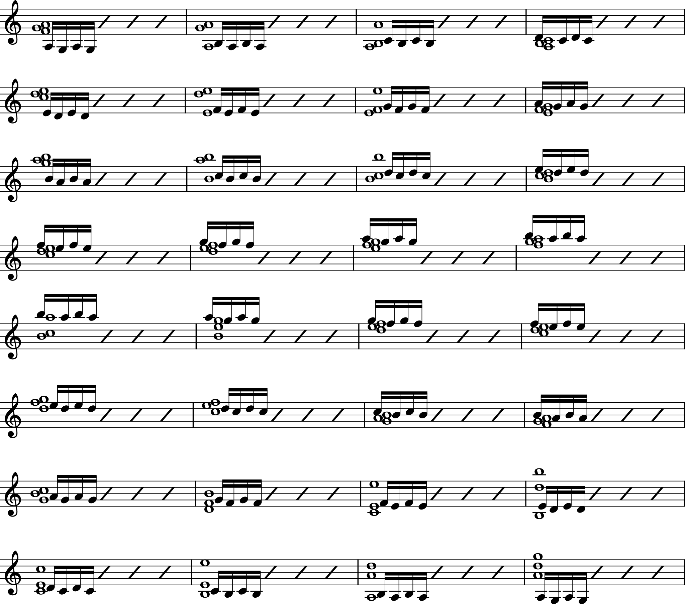
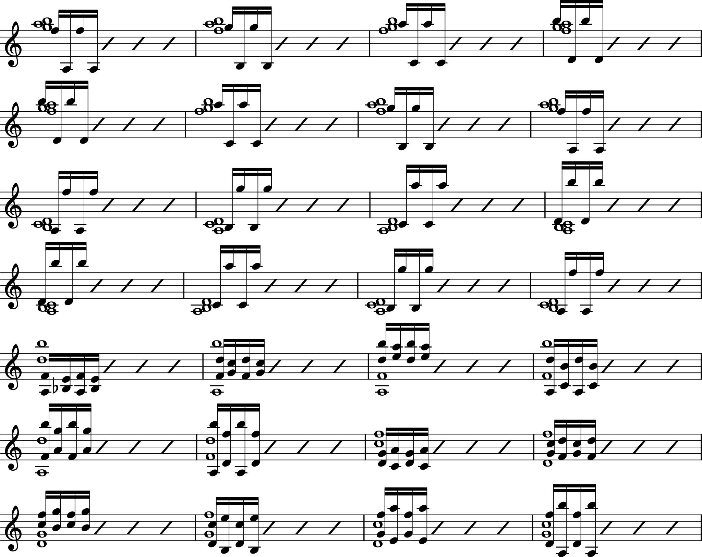

## A. Duration: 3 minutes.

Three of the fingers must remain upon the intervals represented by whole notes. The active finger, however, should be raised as high as possible, and should fall upon the string with elastic surety, minus any possible stiffness and with no greater strength of pressure than its own weight and velocity of movement produces. All exercises must be practiced very slowly, otherwise they will miss their intended purpose entirely.

This exercise must be repeated in the following manner: Instead of leaving the finger playing the lower of sixteenth notes, raise it immediately when striking the higher note. This procedure is similar to that of a pianist playing a trill (shake) on the piano. In this way the number of movements is doubled without loss of time.

\pagebreak

## D. Duration 1 minute
  
In order not to tire the fingers continue with the thumb exercise from the third to the first position in the following manner:

{width=256px}

## B. Duration 4 minutes
  
The fingers must remain on the whole notes while the sixteenth notes are slurred with a glissando; the finger playing the glissando, naturally, must not leave the string. Gymnastic exercising of this kind will evidently be new to many violinists and will tire their hand very quickly. One cannot repeat too often how extremely dangerous it is, not to heed nature's warning in continuing to practice without resting. It is best to relax the arm frequently in order that the circulation of the blood may again become regular. In about thirty seconds the fatigue will disappear. Most injuries to the hand, which have spoiled many a career, have been caused by disregard of this fundamental rule.

\pagebreak

## E. Duration: 1/2 minute

We now come to the combined exercise of the Wrist and the Elbow. This is how to execute it. Fake the following chords, and (without leaving the strings) slide to the second, then return to the first chord. Repeat the exercise 16 times (2×8). In this way the arm and hand will be well-prepared for the changing of positions treated in Study № II combined with different bowings.

{width=218px}

## C. Duration 4 minutes

The studies for the left hand are concluded with an exercise in which the chord movement is to be practiced in the following three varieties:

\newpage

## Acknowledgement

This document is taken from the first part of Carl Flesch's Urstudien, a brilliant exercise for your left-hand fingers, and something suitable for when silence is required. The Urstudien itself has entered the public domain, and any code used to generate this document which is not derivative of the Urstudien is licensed with the MIT license. You can find the source code in this repository: https://github.com/PowerSnail/sheet-music.